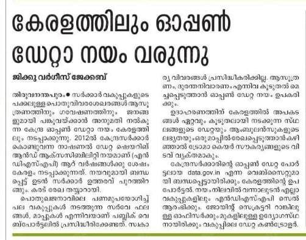
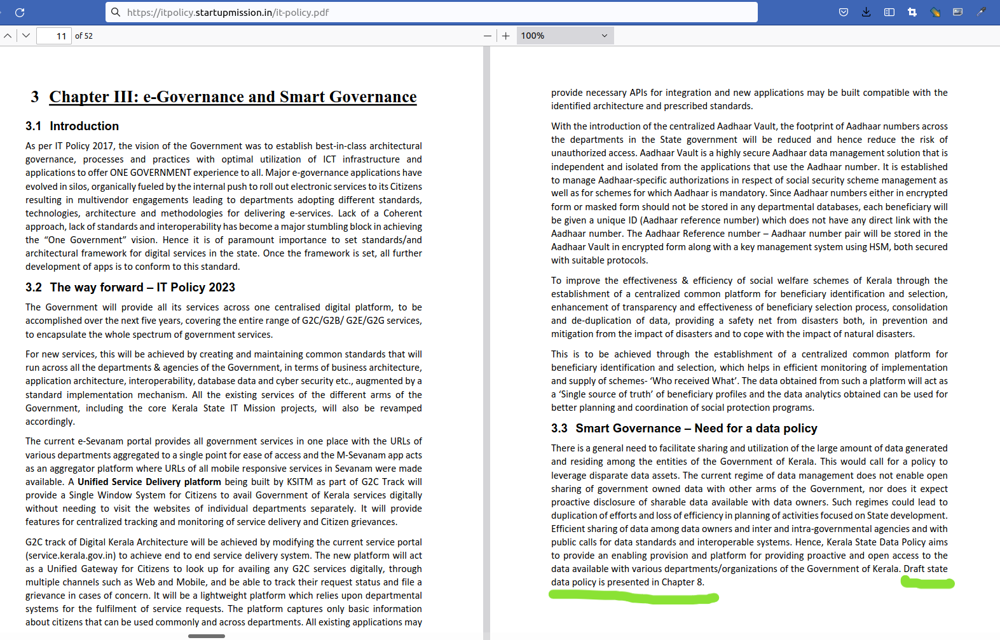
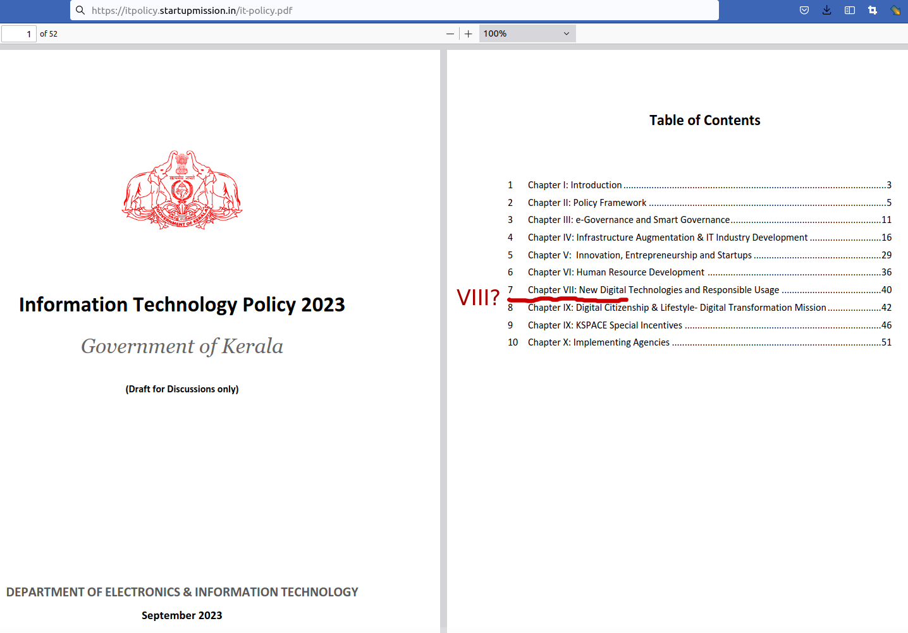

> This is the letter to Kerala Goverment, on Implementation of Open Data Policy ([Kerala's draft IT Policy 2023](https://web.archive.org/web/20231114165712/https://itpolicy.startupmission.in/it-policy.pdf)) on behalf of the OpenStreetMap Kerala Community, dated 10 November 2023

## What is Opendata ?

    <iframe
        src="https://www.youtube.com/embed/DtL5c_KI78I?si=ZUdMrPLS7aInF3Op"
        frameborder="0"
        allowfullscreen
        class="absolute top-0 left-0 w-full h-full"
        allow="accelerometer; autoplay; clipboard-write; encrypted-media; gyroscope; picture-in-picture; web-share" title="YouTube video player"
    ></iframe>

Dear Sir/Madam, 

We, the undersigned members of the OpenStreetMap (OSM) Kerala community, collectively address this petition to express our deep concerns about the prolonged delay in implementing the Open Data Policy in Kerala. As a community dedicated to mapping initiatives, we have consistently encountered reluctance from government officers to share crucial data during our interactions with various government departments. Our primary objective is to leverage public funds to create open data that can be used for the collective benefit of society.

Media reports on October 16, 2018, indicated the imminent implementation of the Kerala Open Data Policy. However, progress has been slower than expected. This delay has adversely affected our ability to contribute effectively to open data initiatives, hindering our preparedness for significant events such as the 2017 Okhi cyclone, the 2018 floods, recurring floods in 2019, and the ongoing challenges posed by the pandemic from 2020 to 2022.

The maps created by OSM Kerala community members have played a crucial role during these crises, aiding in efficient response and management. Open data is a powerful tool for disaster preparedness, response, and recovery. Timely access to accurate and comprehensive data enables us to make informed decisions, coordinate relief efforts, and enhance overall community resilience.

It is disconcerting to note that the current draft of the policy initially included a chapter on open data, a critical component for the socio-economic development of the region. Unfortunately, this chapter was later removed, creating a void in the policy framework. We believe that the inclusion of a dedicated chapter on open data is essential to providing a clear and comprehensive roadmap for its implementation.

We believe that the implementation of the Open Data Policy in Kerala, aligned with the IT Poli**cy 2023, is crucial for the following reasons:
1. **Disaster Preparedness:** Open data facilitates better disaster preparedness by providing real-time information on vulnerable areas, emergency resources, and evacuation routes.
2. **Effective Response:** During crises, open data enables us to create dynamic maps that assist in resource allocation, emergency response coordination, and the dissemination of critical information to the public.
3. **Innovation and Collaboration:** Open data fosters innovation by allowing developers, researchers, and community members to create applications and solutions that address local challenges. Collaboration becomes more seamless with accessible and standardized data.
4. **Public Accountability:** The implementation of open data policies ensures transparency in governance. It empowers citizens by providing access to information, promoting accountability, and encouraging public participation in decision-making processes.

We strongly urge you to prioritize and expedite the implementation of the Open Data Policy in Kerala. The central government notified this policy in 2012, and we believe that Kerala should swiftly follow suit to harness the benefits of open data for public welfare.

Thank you for your attention to this critical matter. We trust that your commitment to the timely implementation of the Open Data Policy will contribute to the overall well-being and resilience of our community.

Sincerely,
OSM Kerala

<iframe
    src="https://ee.kobotoolbox.org/i/BP6Qxofh"
    frameborder="0"
    class="aspect-auto w-full h-96"
></iframe>

